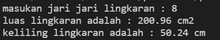
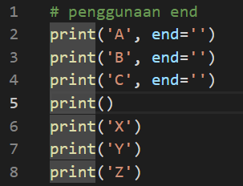

# pratikum2
Tugas Bahasa Pemograman
Nama : Michael valentino laisina
Kelas : TI.21.C1
NIM : 312110045

## MEMBUAT PROGRAM MENGHITUNG LUAS DAN KELILING LINGKARAN
Script sebagai berikut 

 

Buat variabel phi, radius, luas, keliling. Masukan nilai phi 3.14, phi adalah sebuah konstanta dalam matematika yang merupakan perbandingan keliling lingkaran dengan diameternya. Radius adalah jari jari lingkarang yang akan dimasukan atau di input kan oleh user. Jika ingin mencari luas gunakan rumus luas phi x radius x radius kedalam variabel luas. Dan jika ingin mencari keliling masukan juga rumus keliling 2 x phi x radius pada variabel keliling seperti gambar diatas. 

Output yang dihasilkan jika memasukan jari jari 8 cm 

 

FLOWCHART nya sebagai berikut : 

# LAB1
Script

Output

Script

Output

Script

Output

Script

Output

# LAB2 
Script 

Output nya jika yang diinputkan 1 

